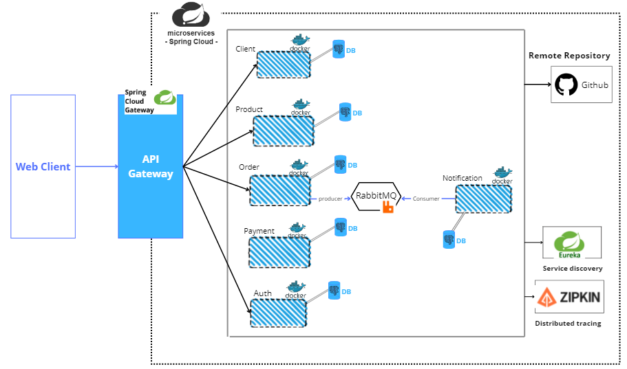
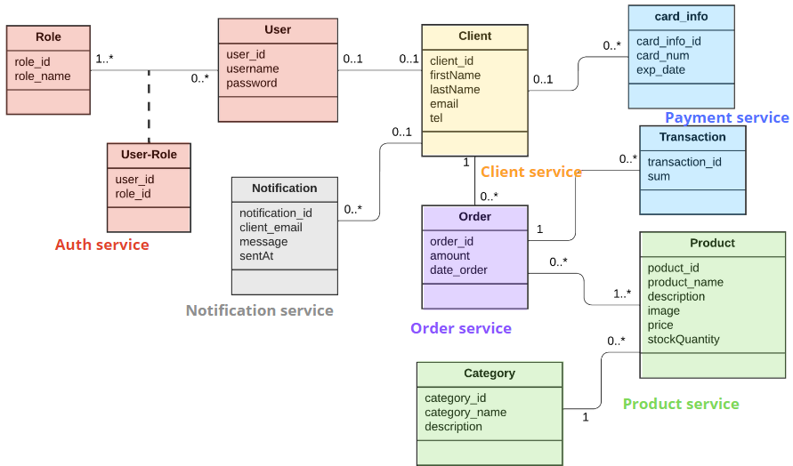
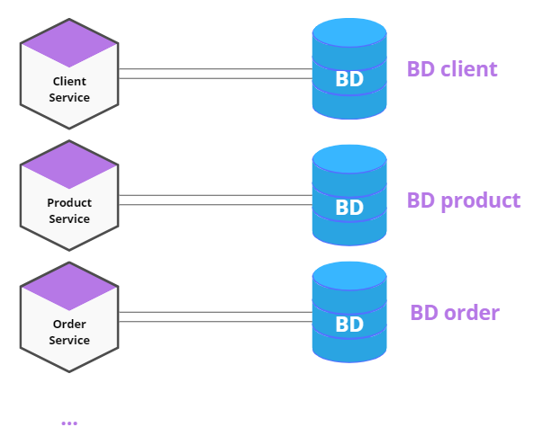
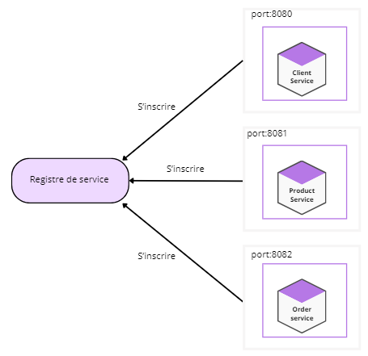
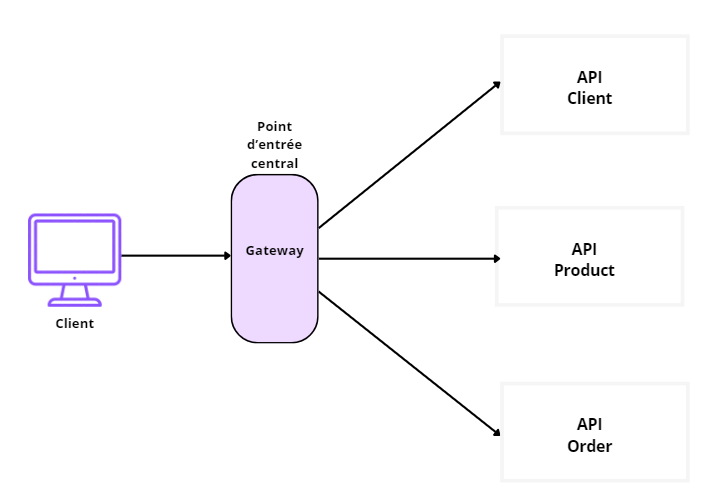
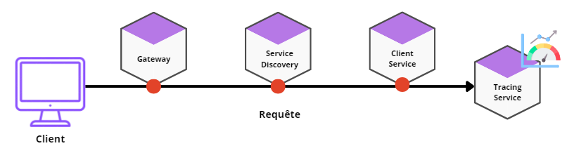
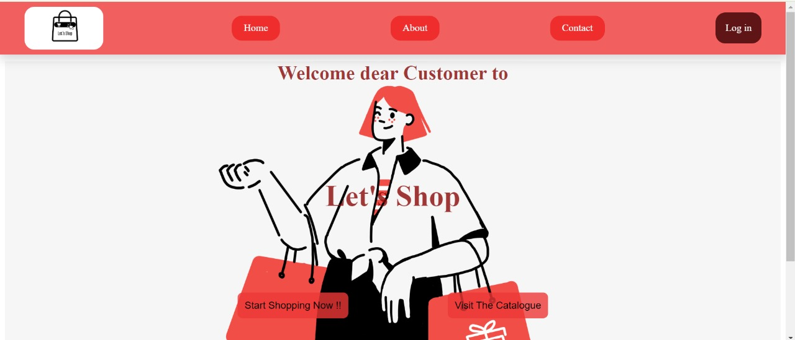
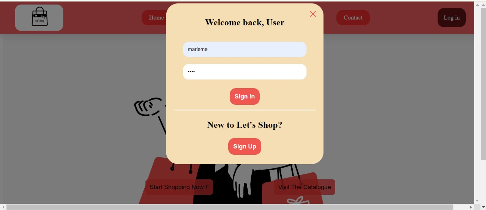
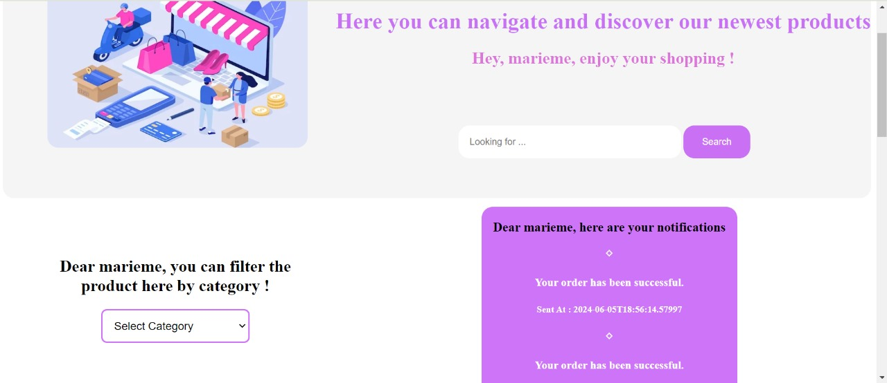
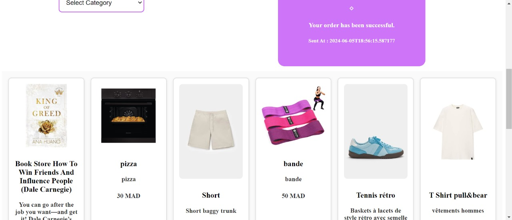

# Ecommerce website with microservice architecture

# Preview

Architecture of the app:

    

# Table of content

- [Technologies](#technologies)
- [Design](#design)
- [Microservice design patterns](#microservice-design-patterns)
    - [Database Per Service](#database-per-service)
    - [Service Registration and discovery](#service-registration-and-discovery)
    - [API Gateway](#api-gateway)
    - [Distributed tracing](#distributed-tracing)
    - [Communication between services](#communication-between-services)
- [Results](#results)
- [Contributeurs](#contributeurs)

# Technologies

**Framework:** Spring Boot  (
  Maven ,
  Java 17 )

**Server:** Apache web server 

**Database:** PostgreSQL 

**HTTP Request tests:** Postman PostgreSQL 

# Design

## Class diagram

From an initial class diagram, we divided our app into different services:

    

# Microservice design patterns

## Database Per Service

We used containerized PostgreSQL databases for each service to ensure data encapsulation and independant scaling. This allows each service to be built, deployed and scaled along with its own database independently. 

    

## Service Registration and Discovery

The service register acts as a centralized directory containing the location of each existing service. Whenever a new service is deployed, it has to subscribe first to the service registry by sending its IP adress and port number. Other services or clients can then query the service registry to find and communicate with these services dynamically.

    

We used `Netflix Eureka` for our service registry. Eureka is a service registry and discovery tool developed by Netflix, and it is part of the Netflix OSS stack. 

## API Gateway

The API gateway is a server thats acts as an intermediary between clients and the backend services. It helps manage and route API requests from the client to the various microservices. 

    

For this, we used the `Spring Cloud Gateway` dependency. 

## Distributed tracing

This is a method used to monitor and observe requests as they flow through a distributed system. As each request from a user might trigger a chain of interactions beteen multiple services, distributed tracing allows us to track and visualize the entire lifecycle of that request.

    

We used 2 famous tools for distributed tracing: 

- `Zipkin`:

An open-source distributed tracing system that helps collect, visualize, and analyse trace data.

- `Spring Cloud Sleuth`:

A library from the Spring Cloud ecosystem that provides distributed tracing for Spring Boot applications. It integrates with with Zipkin (or any other tracing system) to automatically add trace and span IDs to logs and propagate them across service boundaries.

## Communication between services

### Synchronous

`Feign Client` is a declarative web service client provided by Spring Cloud that simplifies the process of making HTTP requests between services. It is typically used for synnchronous communication where the sender waits for a response from the receiver before proceeding.

Synchronous communication is straightfowrd and easy to implements, but sometimes issues arise from it; if each service had to wait until there is a response to resume, and if some services are unavailable to generate a response, several active services will become blocked, leading to cascade failures, where the failure of one service can cause the failure of other services as well.

In such cases, asynchronous communication are often preferrend to enhance system resiliance and performance.

### Asynchronous

A `message queue` is a form of asynchronous communication sent from one component to another in a way that decouples the sender from the receiver, allowing reliable communication even when the recipient is temporarily unavailable. Basically, the sender (producer) doesn't have to stay stuck waiting for the recipient (consumer) to receive the request before resuming its work. All of this is handled and managed by the message broker. 

We used `RabbitMQ` for the broker, known for its flexibility and support for complex routing and messaging patterns.

# Results

Keep in mind, this was a small projects aimed mainly at understand the core principles of the microservice architecture. As such, the frontend aspect was kept to a minimal and simplistic design.

- Home page:

    

- Login modal: (Only loged in users could purchase items)

    

- Catalogue page:

    

    

# Contributeurs

- [@Cristal32](https://github.com/Cristal32)
- [@fatibr19](https://github.com/fatibr19)
